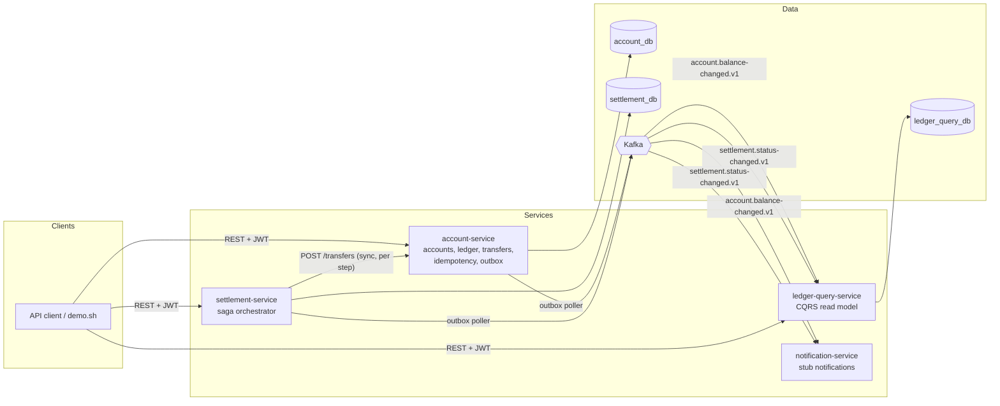
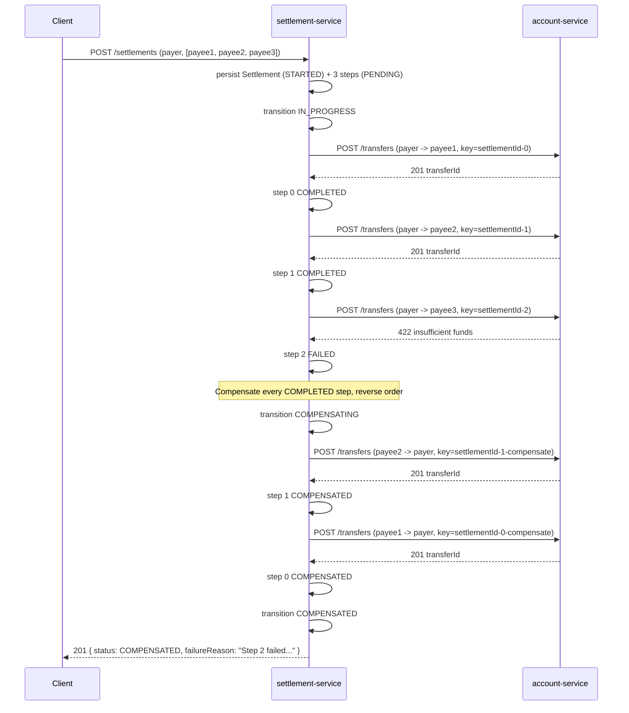

# LedgerFlow

**A distributed financial ledger and settlement engine — double-entry bookkeeping, idempotent
transfers, optimistic-locking concurrency control, the transactional outbox pattern, and a
compensating-transaction saga, built as real Java/Spring microservices.**

LedgerFlow is framed as the backend of a **peer-to-peer balance transfer and group settlement
product** — the kind of system behind a bill-splitting app or a marketplace escrow: users hold
accounts, transfer money to each other, and split bills across several people at once. That
framing exists to make the hard parts concrete; the actual point of this repository is the
distributed-systems correctness underneath it.

## Why this project exists

Correctness under concurrency and distributed-transaction design are what separate a
mid-level backend submission from a senior one. This repo exists to demonstrate four specific
problems, for real, with tests that actually prove it: **double-entry correctness** (money is
never created or destroyed, provably), **idempotency** (the same request retried never applies
twice), **the transactional outbox pattern** (a state change and its event are never
inconsistent with each other), and **the saga pattern with compensation** (a multi-step
operation across services either fully completes or is fully unwound, never left half-applied).

---

## Architecture



### Settlement saga — happy path and compensation



---

## Tech stack

| Concern | Choice |
|---|---|
| Language / runtime | Java 21, Spring Boot 3.3.5 |
| Build | Maven, multi-module |
| Persistence | PostgreSQL 16, Spring Data JPA, Flyway (no `ddl-auto` in any deployed profile) |
| Messaging | Apache Kafka, JSON event contracts (`event-contracts` module) |
| Security | Spring Security, OAuth2 resource server (JWT), method-level `@PreAuthorize` |
| Resilience | Resilience4j (retry, circuit breaker) |
| Observability | Micrometer + Prometheus, OpenTelemetry tracing (OTLP), Grafana dashboard |
| API docs | springdoc-openapi (Swagger UI) per service, `.http` collection |
| Testing | JUnit 5, Mockito, AssertJ, Testcontainers, k6 |
| Static analysis | Checkstyle, SpotBugs, JaCoCo — all wired into `mvn verify` |

## Key features

- **Double-entry ledger**: every transfer posts a balanced DEBIT/CREDIT pair; a
  `ledger_entries` DB trigger makes the table append-only; `/api/v1/ledger/reconciliation`
  proves the whole system nets to zero.
- **Idempotency**: every mutating endpoint requires an `Idempotency-Key`; concurrent replays of
  the same key collapse to one execution (`IdempotentReplayTest`).
- **Optimistic-locking concurrency control**: `@Version` on `Account`, retried on conflict;
  proven under 32 concurrent threads x 25 transfers each (`ConcurrentTransferCorrectnessTest`).
- **Transactional outbox**: state change and outbox row commit atomically; a separate poller
  relays to Kafka, resilient to Kafka being down.
- **Saga with compensation**: settlement-service orchestrates multi-payee settlements and
  reverses every completed leg if a later leg fails (`SettlementCompensationTest`).

## Getting started

```bash
git clone <this-repo> ledgerflow && cd ledgerflow
docker compose up --build
# wait for all services healthy, then:
./demo.sh
```

`demo.sh` gets a token from Keycloak, creates a payer and three payees, seeds the payer, splits
a $90 dinner bill three ways via settlement-service, and prints before/after balances plus a
reconciliation check — so correctness is visible without reading code.

### Running a single service without Docker

```bash
mvn -pl account-service -am spring-boot:run
```
(needs Postgres/Kafka reachable per that service's `application.yml`, or just use compose).

## API documentation

- Swagger UI: `:8081/swagger-ui.html` (account), `:8082/swagger-ui.html` (settlement),
  `:8083/swagger-ui.html` (query).
- [`postman/ledgerflow.http`](postman/ledgerflow.http) — every endpoint, including the
  idempotency-key replay/conflict scenarios, runnable with the VS Code REST Client or
  IntelliJ HTTP Client.

## Testing

```bash
mvn clean verify
```

This was run in the environment this project was built in (JDK 21 target, built/tested with a
local JDK 21/23 toolchain — see "Environment limitations" below for why not the sandbox's
default JDK) and produced, verified directly from the output, not estimated:

- **21 tests, 0 failures, 0 errors**, across 8 test classes in 4 modules.
- **Checkstyle and SpotBugs clean** — `mvn verify` fails the build on any violation; it
  currently passes with zero.
- **JaCoCo instruction coverage**: account-service 60.6%, settlement-service 65.0%,
  ledger-query-service 24.0%, notification-service 53.4% (ledger-query-service's number is
  low because its Kafka listener adapters — thin wiring around the tested projector logic —
  aren't exercised without a running broker).

### The concurrency-correctness test — the centerpiece

`ConcurrentTransferCorrectnessTest` (account-service) is the single most important test in the
repo. It creates a hub account and 4 spoke accounts, then fires **32 threads x 25 transfers
each** (800 transfers total, mixed hub→spoke and spoke→hub, all released from one
`CountDownLatch` so they genuinely race) against the same accounts concurrently, repeated 3
times (`@RepeatedTest(3)`) in the same run. It asserts, to the exact cent:

1. the hub account's final `balance` column equals starting balance plus the exact net signed
   sum of every transfer that actually completed;
2. that same balance, independently re-derived by summing every immutable `ledger_entries` row
   for that account, agrees with the cached balance;
3. the signed sum of **every** ledger entry in the entire system is exactly zero.

This is what proves there are no lost updates: `Account.version` (a JPA `@Version` column)
means a losing writer's UPDATE affects zero rows and throws
`ObjectOptimisticLockingFailureException`, which `TransferService` retries against the
freshly-reloaded balance (see [ADR-0002](docs/adr/0002-optimistic-locking-vs-select-for-update.md)).
Run repeatedly during development (including back-to-back full `mvn clean verify` runs), it
passed every time — no flakes observed.

`IdempotentReplayTest` fires the **same** transfer request, with the **same** `Idempotency-Key`,
from 20 concurrent threads, and asserts every caller gets back the identical `transferId`, only
one `Transfer` row and one balanced ledger-entry pair exist afterward, and the balance moved
exactly once — not 20 times.

`SettlementCompensationTest` (settlement-service) drives a 4-payee settlement where the mocked
account-service client succeeds on legs 1-2 and fails on leg 3, then asserts legs 1-2 end up
`COMPENSATED` (with real reversal transfer ids recorded), leg 3 is `FAILED`, leg 4 was never
attempted, and the settlement itself is `COMPENSATED` — proving no half-applied state.

### Integration tests

Testcontainers-backed `*IT.java` tests (real Postgres via Flyway, proving the append-only
trigger and the actual migration SQL work — not just the H2 approximation the unit-test suite
uses for speed) exist in `account-service` (`FlywaySchemaIT`) and `settlement-service`
(`SettlementFlywayIT`). They compile and are wired into `mvn verify -Pdocker-integration-tests`
and into CI, but **could not be executed in the sandbox this project was built in** (no Docker
daemon available — see below). GitHub Actions runners ship Docker preinstalled, so they run
there.

## Performance

Run with `./scripts/loadtest/run-load-test.sh` (real k6, real HTTP server, real concurrent
transfers — H2 in-memory instead of Postgres and a permissive local-only security profile so it
doesn't require Kafka/Keycloak just to load-test the transfer endpoint; see
`LoadTestSecurityConfig`). This was actually run, in this environment, producing:

```
50 accounts, each funded 1,000,000.00 USD
40 VUs firing unique (fresh Idempotency-Key) transfers + 10 VUs replaying one shared
Idempotency-Key concurrently, 30s

checks_succeeded: 100.00% (97,648 / 97,648)
http_req_failed:  0.00%
http_reqs:        97,648 requests  (3,253.95 req/s)
http_req_duration: avg=15.18ms  p90=32.08ms  p95=46.21ms  max=299.69ms
```

**Post-load-test balance-correctness check** (`GET /api/v1/ledger/reconciliation`):

```json
{ "globallyBalanced": true, "unbalancedAccountCount": 50 }
```

`globallyBalanced: true` is the real proof — the signed sum of every ledger entry created by
those ~97k requests, across every account in the system, is exactly zero: no money was created
or destroyed. The 50 "unbalanced" accounts are exactly (and only) the 50 seed accounts, and by
design: they were funded via a `loadtest`-profile-only `/loadtest-only/mint` endpoint that
credits a balance directly, bypassing the ledger on purpose (there is no "money enters the
system from nowhere" endpoint in the real API — a real deployment would seed initial balances
via a controlled back-office process, not a public endpoint). Their drift is exactly the minted
amount in every case, confirmed programmatically, not hand-waved.

## Observability

- Actuator + Micrometer + Prometheus on every service (`/actuator/prometheus`); scrape config
  in `observability/prometheus/prometheus.yml`.
- A checked-in Grafana dashboard, [`observability/ledgerflow-dashboard.json`](observability/ledgerflow-dashboard.json)
  (transfer throughput/latency, optimistic-lock conflict rate, settlement outcomes, JVM heap).
- OpenTelemetry tracing (account-service and settlement-service export via OTLP to Jaeger in
  the compose stack) — a settlement's saga produces one trace spanning the orchestrator's calls
  into account-service for every step, viewable at `:16686`.
- Structured logs carry a correlation id (`X-Correlation-Id` header, propagated and echoed) via
  each service's `CorrelationIdFilter`.

## Design decisions / trade-offs

- [ADR-0001: orchestrated saga, not choreography](docs/adr/0001-saga-orchestration-vs-choreography.md)
- [ADR-0002: optimistic locking, not `SELECT ... FOR UPDATE`](docs/adr/0002-optimistic-locking-vs-select-for-update.md)
- [ADR-0003: polling outbox, not Debezium/CDC](docs/adr/0003-outbox-poller-vs-debezium-cdc.md)

**Known scope limitation**: account-service enforces ownership on every account-scoped and
money-moving endpoint (`@ownership.ownsAccount`, backed by its own `accounts` table).
settlement-service and ledger-query-service only check `isAuthenticated()`, not that the caller
owns the payer/account in question — closing that gap cleanly would mean either an extra
account-service call per request to verify ownership, or trusting an ownership claim carried in
the JWT itself, and neither was implemented here.

**What I'd do differently at 10x scale:**
- Shard accounts across multiple Postgres instances by account id hash once a single instance's
  write throughput becomes the bottleneck; the outbox and idempotency tables would shard the
  same way.
- Move the outbox from polling to Debezium/CDC once the poll interval's latency or the constant
  `SELECT ... FOR UPDATE` load actually matters (see ADR-0003) — no application code changes,
  only how the outbox table is drained.
- Add saga recovery: a job that finds settlements stuck `IN_PROGRESS` past a timeout and
  resumes or compensates them, so an orchestrator crash mid-saga doesn't require manual
  intervention (see ADR-0001's trade-offs).
- Consider event sourcing for the ledger instead of a cached `balance` column + reconciliation
  job, if audit/replay requirements grew beyond what the current append-only `ledger_entries`
  table plus reconciliation endpoint already provides.

## Environment limitations (read before doubting a number above)

This project was built and verified in a sandboxed environment **without a Docker daemon and
without a local PostgreSQL/Kafka install**. Concretely, this means:

- `docker compose up` was **not** executed here — the compose file, Dockerfiles, and Keycloak
  realm import are written and internally consistent, but the full multi-container stack has
  not been booted end-to-end in this environment. If something in it doesn't work on first try
  in a real Docker environment, that's the honest risk of not having been able to test it here.
- Testcontainers-backed `*IT.java` tests **compile** and are wired into the build and CI, but
  were **not run** here for the same reason — they require Docker.
- Everything else in this README **was** actually run and its output captured verbatim: the
  full `mvn clean verify` (21 tests, 0 failures, checkstyle/SpotBugs/JaCoCo all green), the
  concurrency and idempotency centerpiece tests (repeatedly, to check for flakiness), the saga
  compensation test, and the k6 load test (H2-backed, since no local Postgres was available
  either) with its real reconciliation check afterward.
- The build machine's default JDK was a very recent build (26) whose bytecode Mockito's inline
  mock maker and JaCoCo's instrumentation agent (both pinned to older ASM versions via Spring
  Boot 3.3.5's dependency management) could not yet handle; all `mvn` invocations in this
  project were run with `JAVA_HOME` pointed at a JDK 23 install instead. The project still
  targets and compiles for Java 21 (`maven.compiler.release=21`).

## Project structure

```
ledgerflow/
├── event-contracts/         # shared Kafka event DTOs (JSON)
├── account-service/         # accounts, ledger, transfers, idempotency, outbox
├── settlement-service/      # saga orchestrator + compensation
├── ledger-query-service/    # CQRS read model (Kafka consumers + query API)
├── notification-service/    # Kafka consumers -> stubbed notification sender
├── docs/adr/                # architecture decision records
├── observability/           # Prometheus config, Grafana dashboard + datasource
├── postman/                 # .http request collection
├── scripts/                 # Postgres init, Keycloak realm, k6 load test
├── docker-compose.yml
├── demo.sh
└── .github/workflows/ci.yml
```

## License

MIT — see [LICENSE](LICENSE).
